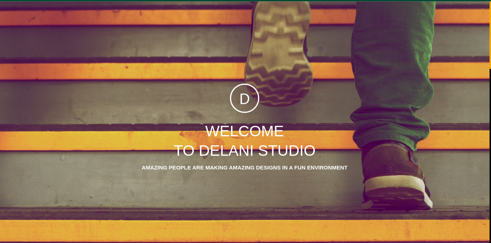

<!--DELANI STUDIO-->


# DELANI STUDIO
**WHAT WE DO**
<br>
**Design**
Our design practice offers a full range of services including brand strategy, interaction and visual design and user experience testing.
Throughout your project, our designers create and implement visual design and workflows, solicit user feedback and work with you to make sure what gets built is what is needed.
<br>
**Development**
All engineers are fluent in the latest enterprise, mobile and web development technologies.
They collaborate with your team to write, and improve code on a daily basis, using proven practices such as test-driven development and pair programming.
<br>
**Product Management**
Planning and development is iterative. Because we are constantly coding and testing, the products we build are always ready to go live. 
This iterative process allows for changes as business requirements evolve.
<br>


## Designing
The page is designed to offer the simplest UI/UX layout on the page, with a responsive UI with the help of bootstrap classes, Jquery methods, HTML markup language and  Mailchimp API

###Bootstrap
<br>
**embeddled**
```
 	<link rel="stylesheet" href="https://cdn.jsdelivr.net/npm/bootstrap-icons@1.10.2/font/bootstrap-icons.css">
 	<link rel="preconnect" href="https://fonts.googleapis.com">
 	<link rel="stylesheet" href="https://maxcdn.bootstrapcdn.com/bootstrap/3.3.7/css/bootstrap.min.css"> 
 	<script src="https://cdn.jsdelivr.net/npm/popper.js@1.12.9/dist/umd/popper.min.js" integrity="sha384-ApNbgh9B+Y1QKtv3Rn7W3mgPxhU9K/ScQsAP7hUibX39j7fakFPskvXusvfa0b4Q" crossorigin="anonymous"></script>
 	<script src="https://cdn.jsdelivr.net/npm/bootstrap@4.0.0/dist/js/bootstrap.min.js" integrity="sha384-JZR6Spejh4U02d8jOt6vLEHfe/JQGiRRSQQxSfFWpi1MquVdAyjUar5+76PVCmYl" crossorigin="anonymous"></script>    
 
```
###Jquery
<br>
**embeddled**
```	<script src="https://ajax.googleapis.com/ajax/libs/jquery/3.6.0/jquery.min.js"></script>
	<script src="https://code.jquery.com/jquery-3.2.1.slim.min.js" integrity="sha384-KJ3o2DKtIkvYIK3UENzmM7KCkRr/rE9/Qpg6aAZGJwFDMVNA/GpGFF93hXpG5KkN" crossorigin="anonymous"></script>
```
###Mailchimp API
<br>
**embeddled**
Mail chimp enabled management of audiences suscribed to the site. It works on a unique Key generated for each audience.

```
<form action="https://gmail.us9.list-manage.com/subscribe/post?u=####unique_Key####;f_id=###unique_Id###" method="post" id="mc-embedded-subscribe-form" name="mc-embedded-subscribe-form" class="validate col-10" target="_blank" validate>
            <input type="text" value="" name="NAME" class="col-md-5 col-sm-10 offset-md-1 mt-2" id="mce-NAME" placeholder="Name...">
            <input type="email" value="" name="EMAIL" class="required email col-md-5 col-sm-10 mt-2 ml-lg-1 " id="mce-EMAIL" required placeholder="E-mail...">
            <textarea type="text" rows="4" value="" name="MESSAGE" class="col-10 my-3" id="mce-MESSAGE" placeholder="Enter your message here..."></textarea>            
            <div id="mce-responses" class="clear foot">
                <div class="response" id="mce-error-response" style="display:none"></div>
                <div class="response" id="mce-success-response" style="display:none"></div>
            </div><!-- real people should not fill this in and expect good things - do not remove this or risk form bot signups-->
            <div style="position: absolute; left: -5000px;" aria-hidden="true"><input type="text" name="b_bd8ca9d8eca462e9b95acd82f_5af448a640" tabindex="-1" value=""></div>
            <input type="submit" value="Send" name="subscribe" id="mc-embedded-subscribe submit" class="button  submit">
        </form>	

```
More on MailChimp API  [here](https://mailchimp.com/)

**Credits**

1. Willan Njenga - Desinger.

**Links**
[Delani Studio](https://wnjenga.github.io/DelaniStudio/)


The favicon used is trimmed from https://delanig.com/


